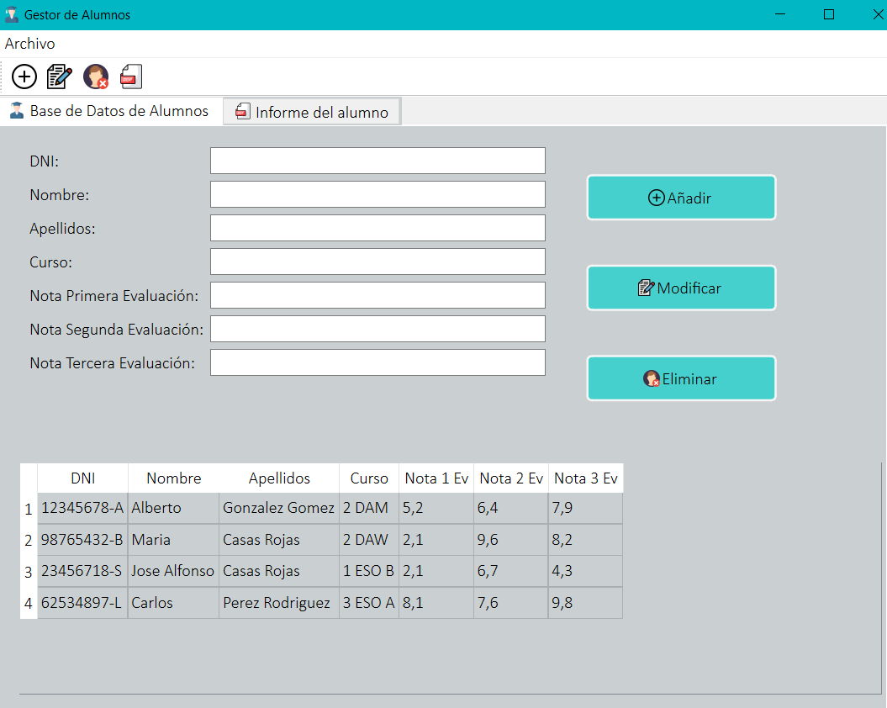
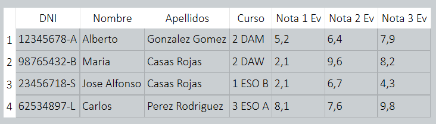
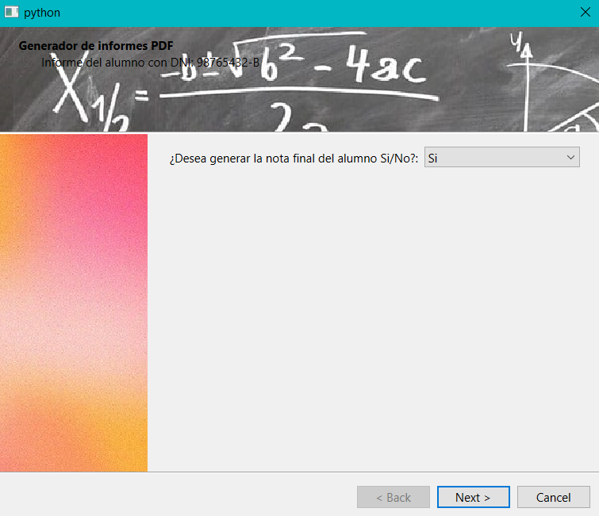
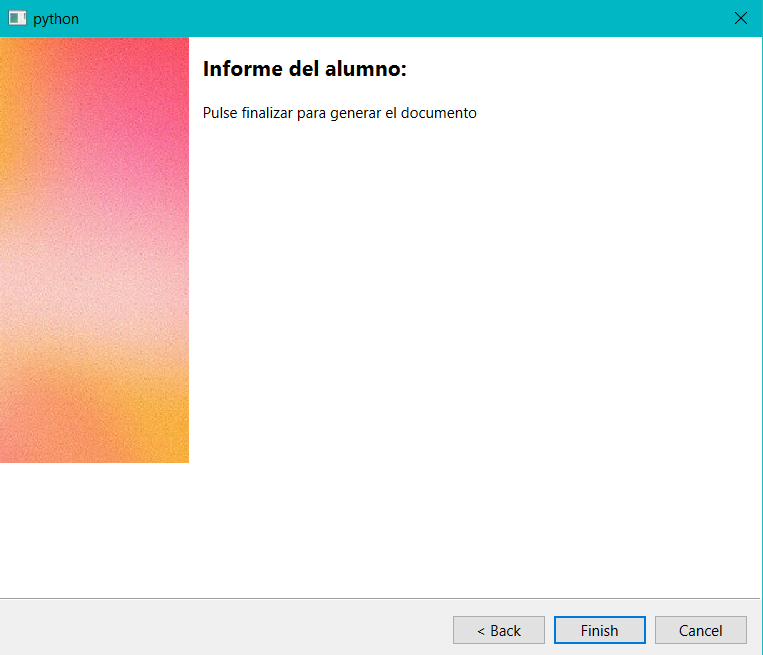
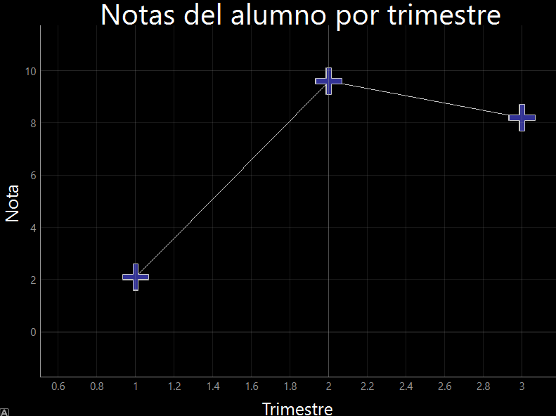
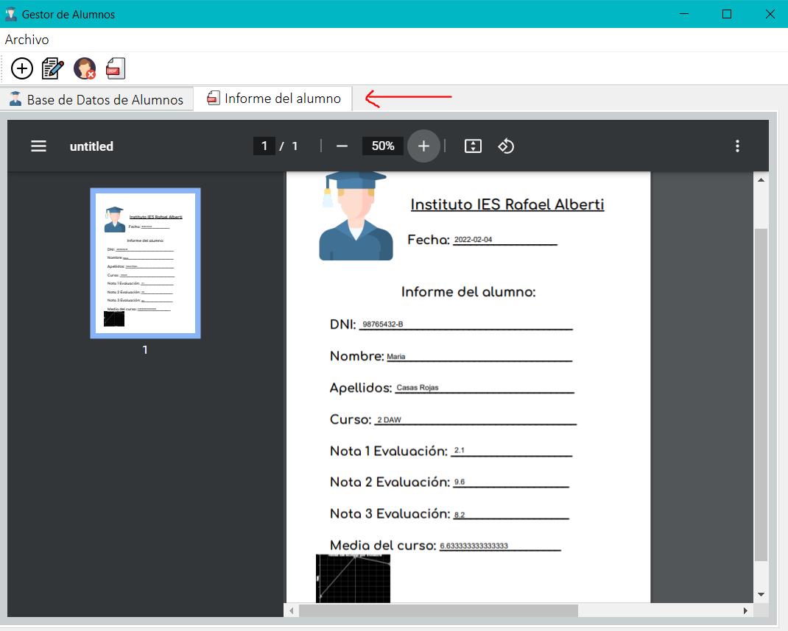

author: Alexis Navarro Moreno
summary: Tutorial de la aplicación Gestor de Alumnos
id: id_codelab_gestordealumnos
categories: primera impresion, principales funciones de la interfaz
environments: Web
status: Published

## Tutorial de generación de PDF con la aplicación Gestor de Alumnos

A continuación le explicaremos los pasos a seguir para generar un PDF del alumno
seleccionado.

## Pantalla principal

   
Esta es la pantalla principal de la aplicación Gestor de alumnos, a partir de ella explicaremos en cómodos pasos como generar un PDF con los datos del alumno escogido.

## Paso 1

Primero seleccionamos un alumno de la tabla de alumnos:
   

## Paso 2

A continuación pulsamos el botón generar PDF:

   

## Paso 3

Nos llevará a un asistente que nos ayudará a genererar nuestro PDF con dos sencillos pasos:
   
   Primero nos preguntará si deseamos generar la nota final del alumno. Seleccionamos una opción y pulsamos next.
   
   
   
   Después nos preguntará si deseamos generar una gráfica con las notas del alumno. Seleccionamos una opción y pulsamos next.
   
   

   Por último pulsamos finalizar.
    
     

## Paso 4

Si hemos elegido generar la gráfica nos saldrá una ventana con la gráfica del alumno:

    

## Paso 5

Podremos visualizar la gráfica tanto en la propia aplicación desde la pestaña Informe 
del alumno:

    

Como en la propia carpeta de la aplicación en un archivo PDF. 

## Enlace al Manual de Uso y Referencia de la aplicación.

Le animo a visitar la web del manual de uso y referencia de la aplicación
¡Accede en caso de más dudas!

[Manual de uso y referencia](https://alexisnavarromoreno.github.io/GestorDeAlumnos/Manualdeusoyreferencia.html)